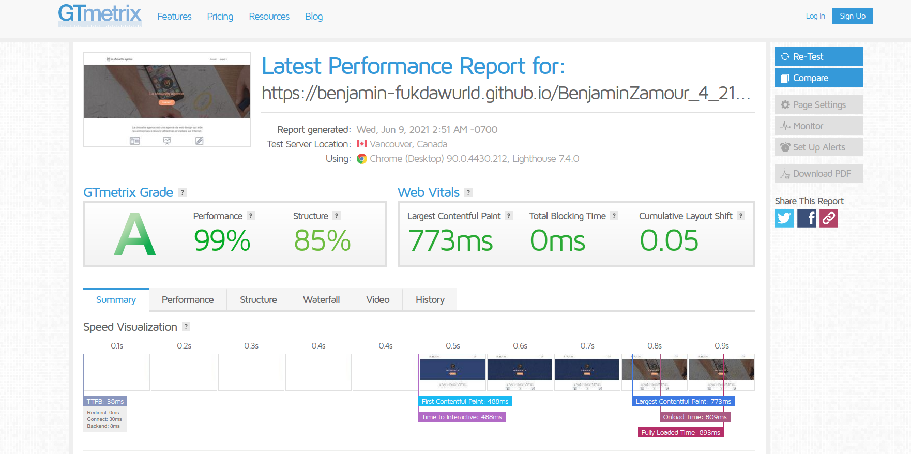
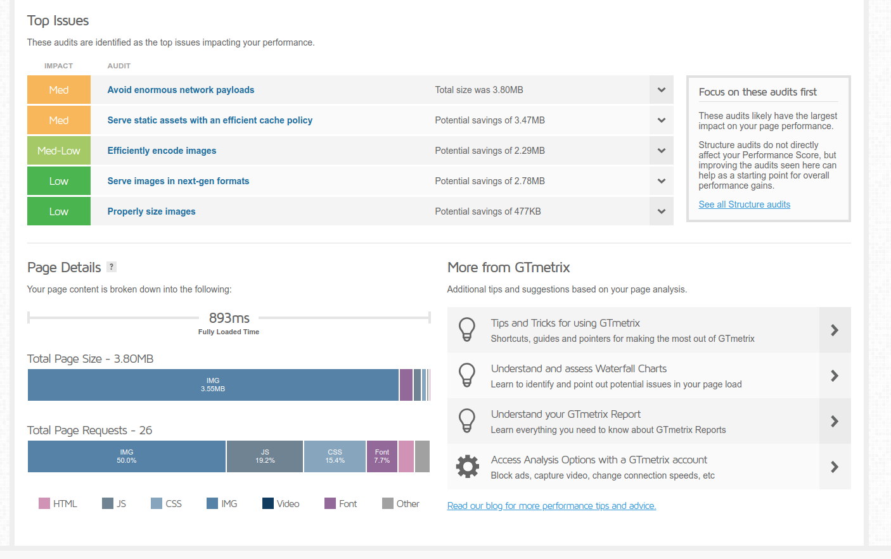
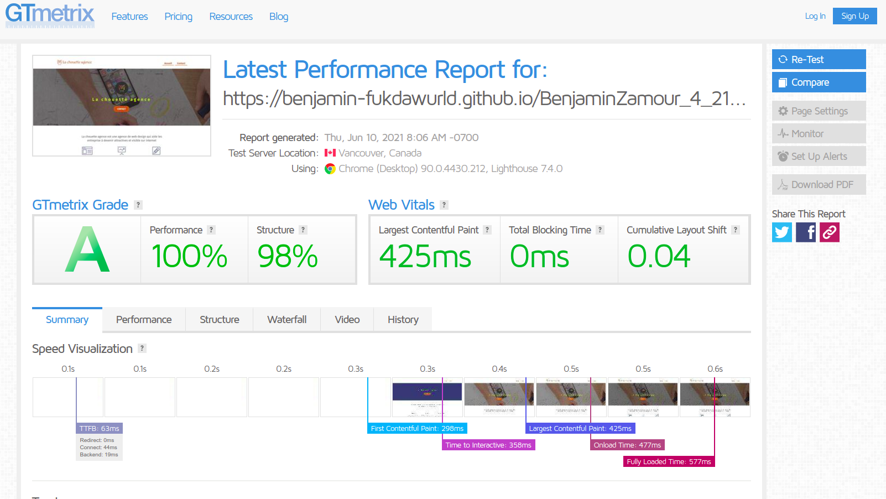
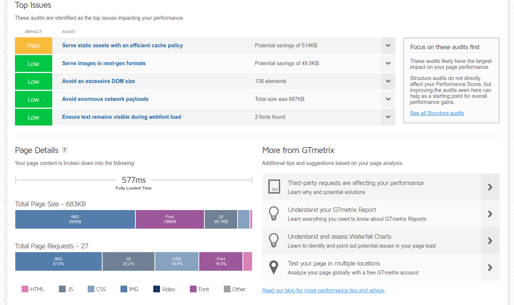

# Améliorer le référencement de La Chouette Agence

## Problématique

> Le but du projet est de faire remonter le site de **La Chouette Agence** aussi haut que possible dans les résultats pour la recherche "_Entreprise web design Lyon_".

## Introduction

L'amélioration du référencement d'un site web n'est pas une tâche ponctuelle. Il s'agit d'une activité chronophage et donc coûteuse. D'autre part, le référencement n'est pas figé dans le marbre, il convient donc de travailler régulièrement et efficacement afin de maximiser ses chances d'apparaître dans les premiers résultats lors des recherches google.

_Le SEO c'est un peu comme **Fight Club** il y a des règles à respecter_

> 1. Avoir un bon contenu,
> 2. Avoir un bon contenu,
> 3. Quelqu'un fait du mauvais contenu, explose les performance ou fait du black hat, le combat est terminé.

## Audit préliminaire

Pour commencer nous allons réaliser un audit préliminaire qui nous permettra de déceler les problèmes et d'identifier les points d'améliorations. Au cours de cet audit nous analyserons également le contenu et nous réfléchirons aux mot-clés à mettre en avant pour améliorer le référencement.

### Déroulé de l'audit

L'audit du site se déroulera de la manière suivante:

-   Déterminer le public cible ainsi que les mot-clés sur lequel nous souhaitons capitaliser pour augmenter la visibilité de l'entreprise.
    -   Dans le cadre de cette mission, nous disposons déjà de la recherche sur laquelle nous souhaitons apparaître parmi les premiers résultats. Il s'agit d'`Entreprise web design Lyon`. À partir de cette information nous devons définir des termes et des expressions équivalentes afin d'éviter d'avoir trop de redondance dans le contenu (Google pénalise la redondance). Ces termes nous serons utiles par la suites lorsque nous les feront l'amélioration du contenu.
-   Détermination des technologies utilisées pour créer le site (_CMS_, _Framework web_, directement _HTML, CSS et Javascript_)
    -   Cette phase de l'audit nous permettra d'appréhender partiellement la charge de travaille ainsi qu'une partie des actions à mettre en œuvre pour mener à bien cette optimisation.
        > Selon la technologie utilisée l'optimisation pour les moteurs de recherche peut-être plus ou moins facilité. En effet les _CMS_ et les _Framework web_ utilisent généralement une base commune (`un template`) pour générer les pages. Cela permet de centraliser une partie des modifications et donc réduire la charge de travail.
-   Détection et recensement des problèmes existants sur le site
    -   Au cours de cette étape nous étudierons les problèmes qu'il soient technique, architecturaux ou liés aux performances
-   Analyse du contenu du site et réflexion sur les optimisations envisageable
    -   Cette étape et sûrement **la plus importante** de toutes. En effet le contenu, comme dit précédemment, est le point principal pour un bon référencement. Les visiteurs comme Google apprécieront plus votre site si le contenu est pertinent, cohérent et régulièrement mis à jour. La cohérence du contenu est l'élément qui va conditionner l'exploitation des mots-clés. _Spammer_ les mots-clés ou les utiliser de façon inappropriée peut s'avérer extrêmement pénalisant pour le référencement et surtout pour l'expérience utilisateur. Effectivement, Google et les moteurs de recherche en général ont pour but de mettre en avant les sites les plus susceptibles de plaire aux visiteur. C'est pourquoi il est important de penser son contenu d'abord pour les visiteurs.
-   Nous finiront alors par l'analyse des lien sur le site.
    -   Dans notre cas ces liens n'existe pas vraiment car le site n'est pas en ligne

Une fois cette audit réaliser nous allons nous pencher sur les tâches à effectuer afin d'optimiser notre référencement.

### Les points à corriger et améliorer

L'audit nous à permis de mettre au jour ces problèmes:

-   Les images du site ne sont pas optimisées pour le web

    -   certaines image ne sont pas à la taille la plus optimale
    -   certaines images sont au format **BMP** ce qui n'est pas adapté au web car pas compréssé.
        > Pour palier à ce problème nous allons donc retravailler les images afin de leur données les dimension les plus adapté à leur taille d'affichage ainsi qu'utiliser le bon format d'image. Nous ajouterons également une version en `webp` de ces images pour fournir le format le plus adapté au web aux navigateurs qui le supportent. Nous garderons quand même une version en `jpeg` pour supporter tous les navigateurs.

-   La langue du site n'est pas renseignée.

    -   Il n'est pas essentiel de préciser la langue d'un site, qui n'est disponible qu'en une seule version (en terme de langue ou de région) pour le SEO malgré tout cela permet aux lecteurs d'écran de savoir comment lire le contenu et dans quel langue il est.
        > Si le lecteur ne dispose pas de cette information il va essayer de déduire la langue ce qui peut conduire à des comportement indésirable (notamment sur la lecture des nombres).

-   Spamming de mot clés notamment dans la balise `meta keywords`

    -   L'utilisation répétitive de mots-clés est pénalisé par les moteurs de recherches.
    -   Certains mots-clés sont cachés dans le contenus de la page ce qui constitue une pratique déloyale et est pénalisé par les moteurs de recherches.
        > Nous allons corriger se problème en supprimant la balise `meta keywords` qui n'est plus prise en compte par les moteurs de recherches et nous allons également supprimer tous les mots-clés invisibles dans le contenu. Nous insérerons les mots-clés que nous aurons choisis de façon cohérente dans le contenu et dans les titres de la page.

-   Absence de description sur les pages du site

    -   L'absence de description pour des pages est un soucis aussi bien pour le référencement, car il s'agit d'un endroit stratégique où mettre nos mots-clés ; qu'en terme d'expérience utilisateur, sans description le visiteur n'a pas plus d'information sur la page que ce que lui fourni le titre.
        > En réponse à ce problème nous allons rédiger une description de 150 à 160 caractères mettant en avant les mot-clés choisis et permettant à l'utilisateur de se faire rapidement une idée du contenu de la page.

-   Absence de titre dans la page d'accueil et titre inutile dans la page de contact

    -   L'absence de titre est assez similaire dans les problèmes qu'elle génère à l'absence de description.
        > Nous allons également répondre à ce problème comme nous le faisons pour le problème de la description. Nous allons rédiger un titre pertinent d'une longueur ne dépassant pas 512 pixels, soit environ 55 à 65 caractères en moyenne (pour éviter qu'il ne soit tronqué). Ce titre devra refléter le contenu de la page et donner autant que possible envie aux utilisateur de visiter la page.

-   Tous les scripts sont en début de page et chargés de façon synchrone ce qui ralenti le chargement

    -   Le fait que les scripts soient chargé de façon synchrone en début de page ralenti le premier affichage de la page.
        > Pour corriger cela nous allons charger les scripts qui ne gère pas l'affichage de façon asynchrone. Cela permettra d'afficher la page avant que les scripts ne soient entièrement chargés.

-   Les feuilles de styles et les script ne sont pas minifiés

    -   Les script non minifiés prennent plus de place en mémoire que leur version minifié pour un même résultat. Cette différence de taille implique un temps de chargement plus long ce qui nuit à la _crawlabilité_ du site.
        > Nous allons utiliser des outils de minification pour générer les versions minifiées de ces fichiers.

-   Les balises sémantiques ne sont pas utilisées
    -   Les balises sémantiques permettent de donner des meta-informations sur le contenu de la page. Ces informations aide les moteurs de recherche à identifier le contenu d'une page et donc facilite son analyse.
        > Pour corriger cela nous allons séparer les la page en 3 zones principales, `header`, `main`, `footer`. À l'intérieur du `main` nous allons subdiviser le contenu en `section` et mettre le contenu indépendant à l'intérieur d'`article`.

## Les optimisations off-page

### Google my business

Afin d'améliorer le SEO locale et mettre en avant l'agence pour les utilisateur faisant des recherche sur Lyon ou précisant qu'il recherche sur Lyon.

### Les réseaux sociaux

La présence sur les réseaux sociaux est un vecteur de visibilité abordable, efficace et simple à mettre en place.

La première étape sera de créer des profil pour l'agence sur les principaux réseaux (\*Instagram, Facebook, Twitter, LinkedIn...).
Chacun de ces réseaux nous permettra de créer des backlinks vers notre site et vers sont contenu. Ils nous permettront de notamment de partager nos article et d'inciter notre communauté à intéragir avec les articles que nous leurs proposons ainsi que de les partager. Ces actions seront les leviers qui nous permettrons de gagner en crédibilité et en cohérence vis-à-vis des moteurs de recherche.

### Les partenariats

Afin de maximiser nos chance d'être bien placé par les moteur de recherche, il est important de faire parler de nous. Un moyen efficace de faire parler de l'agence serait de nouer des partenariat avec des sites pertinents. Ces partenariats nous pouvons par exemple les créer avec nos clients, nous pouvons leurs proposer (en échange de contre-parties) d'écrire ou de partager des articles sur nous, sur leurs sites ou via leurs réseau sociaux. Nous pouvons également contacter des société des domaines connexe au notre (IT, Hébergement, communication, conduction de changement...) pour leur proposer également d'écrire ou de partager des articles élogieux sur notre société toujours en échange de contreparties. Nous pouvons également contacter des sites d'actualités spécialisés dans le domaine afin de tenter de faire publier et partager nos articles.

## Les optimisations du temps de chargement

L'audit à révélé des problèmes nuisant au temps de chargement de la page, notamment concernant les fichiers resosurces. Afin d'optimiser le temps de chargement nous avons réaliser les tâches suivantes:

-   Réduction de la taille des images, dans la mesure du possible, afin qu'elles soient autant que possible adapté à leur taille d'affichage sur les pages.
-   Utilisation du format webp pour les images plutôt que le bmp ou le jpeg afin de gagner en temps de chargement.
    > Cette tâche n'a pas été réalisé sur toutes les images car certaines d'entre elles sont utilisé dans le code CSS et certains navigateur ne prennent pas en charge ce format. L'utilisation du format webp aurait nécessité la mise en place d'un système de _fallback_ si le format n'est pas supporté qui aurait demandé l'ajout d'utilitaires javascript. Ceci pourrait évidemment être fait dans le cadre d'une prestation complémentaire.
-   La _minification_ des fichiers CSS et Javascript
-   Le chargement en différé ou de façon asynchrone des scripts non essentiel pour l'affichage du contenu.
-   L'épuration d'une partie du code en HTML (liens peu pertinents dans le footer, keyword spammés sur la page etc.)
    > L'outil utilisé pour la génération du site peu également minifier le HTML si l'environnement de prod est précisé lors de la génération.

### Les résultats obtenus

Pour analyser les performance de la page nous avons décidé d'utiliser [GT Metrix](https://gtmetrix.com/)

Voici des captures d'écrans des résultats de l'analyse avant les modifications:

Et voici les résultats après avoir appliqué les modification

Pour commencer nous pouvons constater une amélioration de la qualité structurelle du site de **13%** la faisant passer de 85% à 98%.
On constate également la diminution du temps de rendu du contenu le plus important (en terme de volume de données), passant de 773ms à 425ms, soit une amélioration de l'ordre de **45%**.
D'un point de vu global, le temps de chargement de la page est passé de 893ms à 577ms ce qui représente une amélioration de plus de **35%** des performances de la page.

Les actions effectuées lors de cette phase d'optimisation nous ont permis d'améliorer significativement les performances de la page, cependant il persiste des axes d'améliorations envisageable au cours d'une prochaine passe d'optimisation.
On pourrait par exemple comme dit précédemment améliorer la prise en charge des image dans des formats plus récents comme le webp dans les feuilles de style CSS en suivant par exemple les indications fournies par [cette article de CSS-tricks](https://css-tricks.com/using-webp-images/). Il serait également très intéressant de travailler conjointement avec les équipes opérationnelles afin de configurer la mise en cache du contenu statique pour améliorer encore les performances.

## Conclusion

À ce jour, les améliorations en terme de SEO, d'accéssibilité ainsi que de performances ont permi de perfectionner le site autant en terme de visibilité qu'en terme d'expérience utilisateur.

Malgré ce chantier, il est important de veiller à suivre les bonne pratiques conseillées dans le rapport joint à ce document. Il est également impératif de réaliser une veille technologique régulière afin de rester en adéquation avec les recommandations des moteurs de recherches.

Enfin, il me semble primordial de rappeler la règle principale pour une bonne visibilité sur internet, autant pour les moteurs de recherche que pour les réseaux sociaux. Il est absolument nécessaire de générer régulièrement du contenu de qualité afin de susciter l'intérêt de nos visiteurs.
